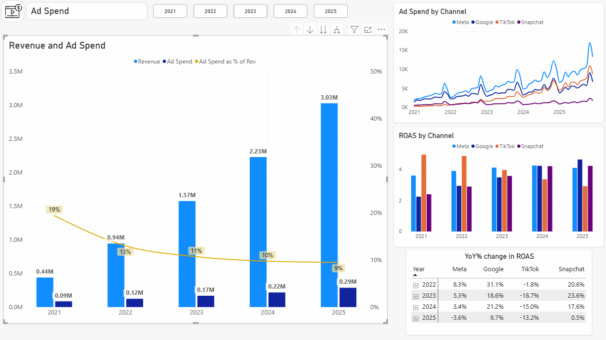
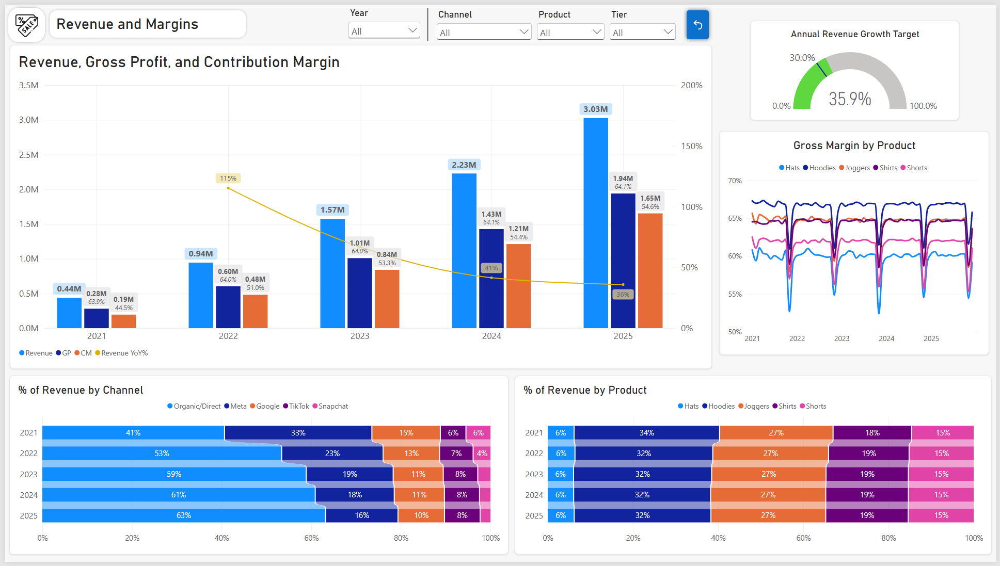
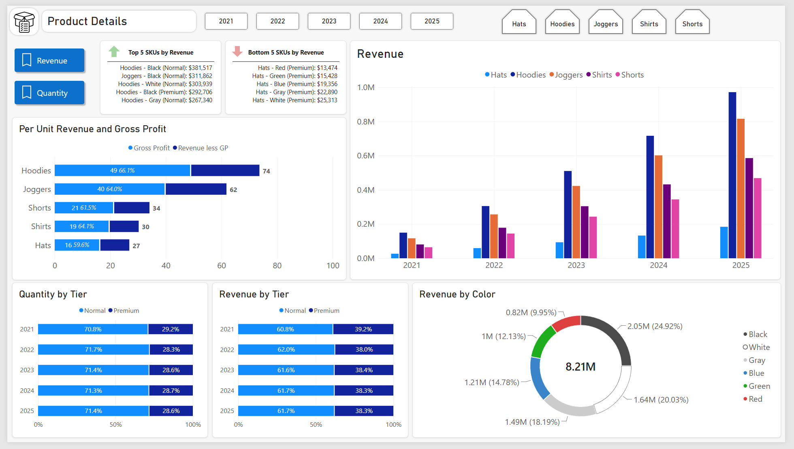
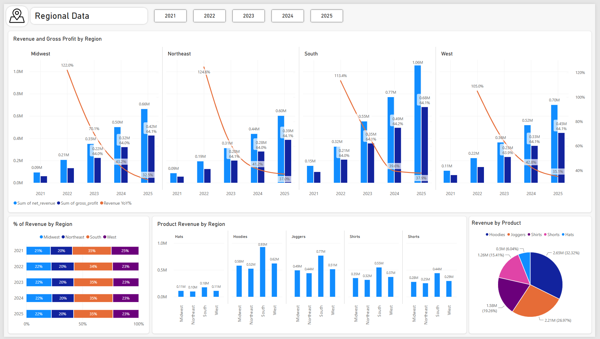
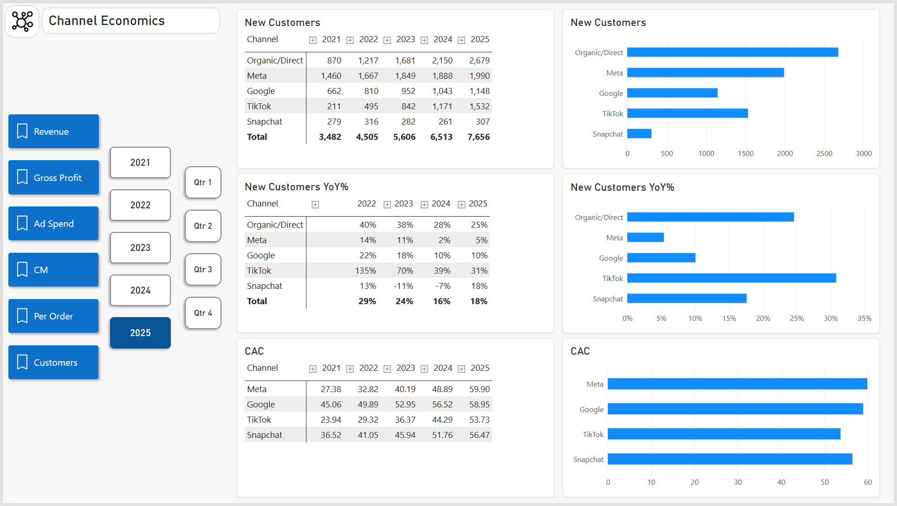
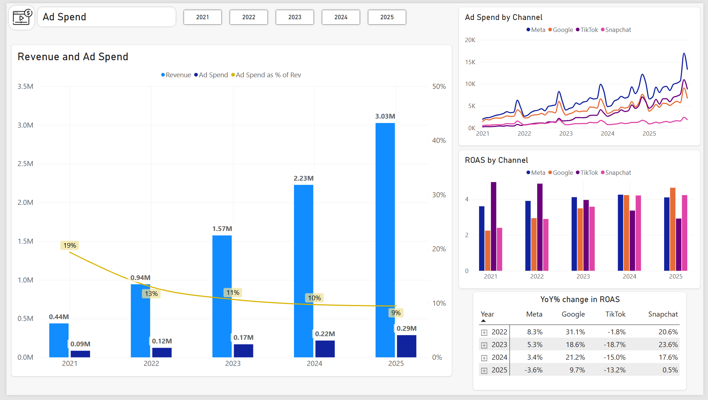
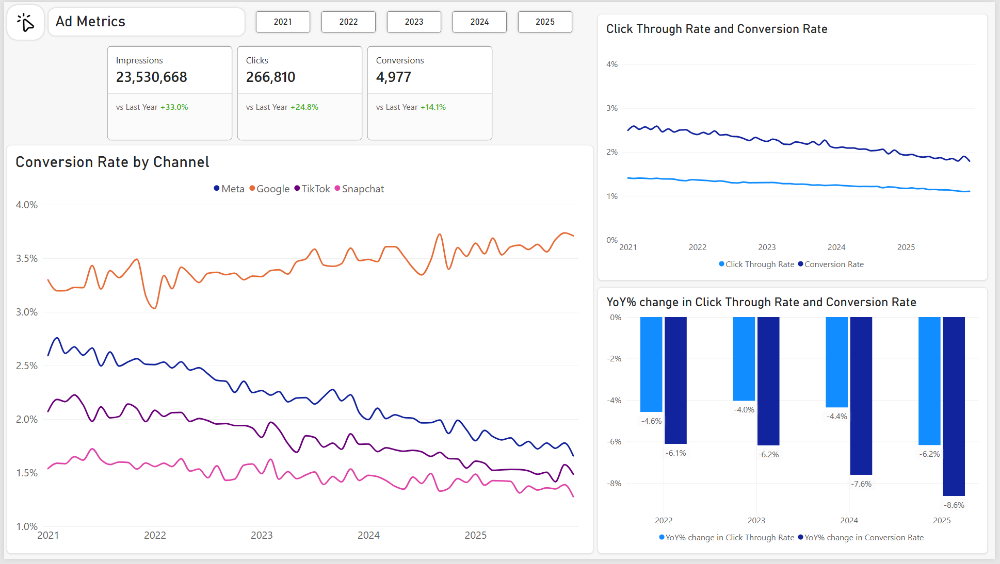
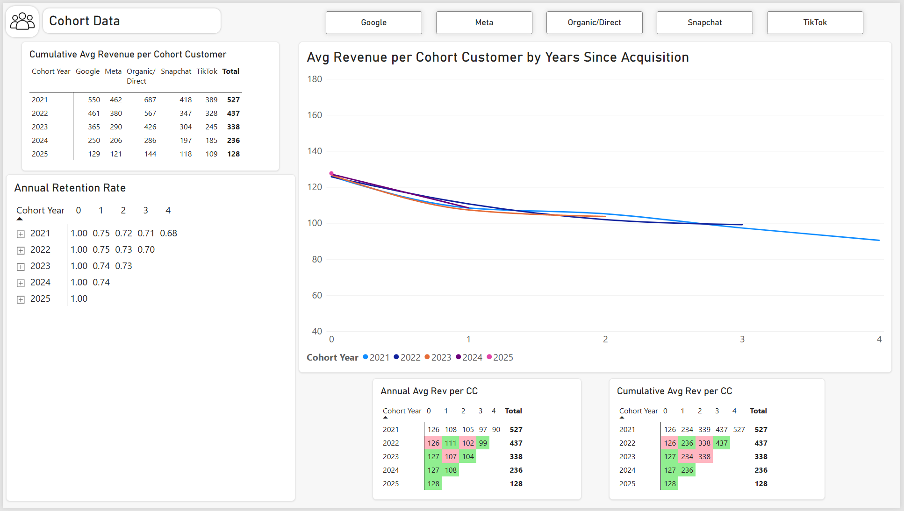
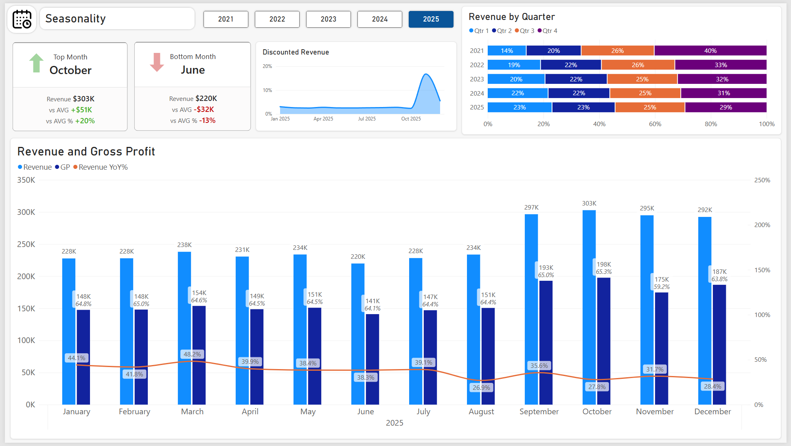
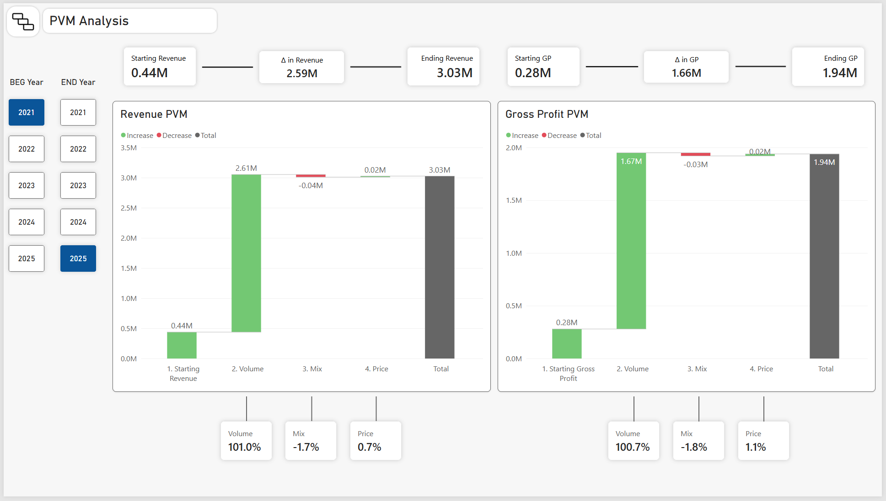

# Sales & Marketing Analysis - Fictional DTC Athletic Apparel Company

## Overview
For this Project I used Claude to generate a synthetic five-year dataset for a fictional direct-to-consumer athletic apparel company &mdash; covering sales, marketing spend, and customer behavior. I then used SQL and Power BI to analyze business performance and develop data-driven recommendations.

*See preview of report pages below. See the .pbix file in the repo to interact with the visuals.*

## Data & Tools

* 📅 Dataset timeline: 2021 - 2025
* 🗂️ Data model: Star schema with two fact tables (Orders, Ad Spend) and four dimension tables (Date, Channel, Customer, Product)
* ✨ Claude: Python script for synthetic dataset
* 🐘 PostgreSQL: Created database and a custom view for customer cohort analysis (vw_cohort_activity_annual)
* 📊 Power BI: Power Query Editor for data validation, visuals, measures, calculated columns, calculated tables, conditional formatting 

## Main Insights
* **Ad spend** &mdash; The company should increase its share of ad spend to Google and decrease its share of spend from TikTok. TikTok was previously the best performing paid channel, and Google was the worst (see report pages Channel Economics and Ad Spend). Recent results show the situation has flipped, and action needs to be taken: 

    * Ad spend as a % of revenue continues to fall as organic/direct's share of revenue continues to increase. When looking only at paid channels however, ad spend as a % of revenue has ticked up slightly YoY for the very first time (from 25% in 2024 to 26% in 2025).
   
    
    
    

    
    
   
   
    
   
    * In 2025 Google's ROAS was the highest at 4.6x vs TikTok's 2.9x.
    * On top of this, Google's ROAS and conversion rate are increasing YoY (+9.7%, +3.4%) while TikTok's ROAS and conversion rate are decreasing YoY (-13.2%, -8.8%).
    * TikTok's CAC has grown quickly from $24 to $54, which is now just slightly below other paid channels (Google's CAC is $59).
    * o	Despite the now similar CACs, Google's customer retention rates and avg customer spend are much more attractive. After four years, Google's customers who were acquired in 2021 have cumulatively spent an avg of $550 vs TikTok's customers at $389 (+41%). The company has retained 70% of these Google customers while only retaining 53% of TikTok customers (the lowest retention rate of all channels).
    * Recent vintages show this gap growing wider:

        | Cohort | Google Cust. Y0 Spend | TikTok Cust. Y0 Spend | Diff |
        |---|:---:|:---:|:---:|
        | 2021 | $126 | $112 | +13% |
        | 2025 | $129 | $109 | +18% |
    * This data suggests that the company's advertising has reached oversaturation on TikTok. TikTok's share of ad spend should be lowered until ROAS returns to a level that is in line with other paid channels. Google is now outperforming other paid channels and should receive a higher share of ad spend. In addition, the company should also look at adjusting its advertising strategy on TikTok.

* **Color trends** &mdash; Neutral colors outperform others in quantity sold and revenue, accounting for over 60% of both (see report page Product Details):
    * Neutral color outperformance is consistent across product lines, tiers, and years.
    * I would recommend testing the permanent additions of other neutral color variations to the product lineup. The company should monitor sales to see whether this results in incremental growth of the neutral color category vs cannibalization.
    * To incentivize increased customer engagement and spending, I would recommend the introduction of limited release colorways. This would help increase avg spend per customer (impulse buying prompted by the time constraint) while also giving the company insights into customer demand for colors. Colors that sell exceptionally well should be considered for permanent addition. Engagement would increase due to customers periodically visiting the company's website for updates on new limited releases.

* **Sales growth** &mdash; All growth in revenue and gross profit is due to volume (see report page PVM Analysis):
    * The company should look to introduce variations of even higher margin hoodies and joggers, which consistently account for over half of revenue.
    * Limited release colorways of premium hoodies and joggers at higher than regular price points could help further increase the gains from price and mix.
    * These products should be dropped in release windows from September through December. Again, the company should monitor customer behavior for incremental spending vs cannibalization. It is especially important that release windows are optimized given peak seasonal discounting in November.
    * If successful, these limited releases could be done with the other product categories at different points in the year. 

## Power BI Report Pages - Preview

*Click on report page title to see screenshot*

<strong>1 Revenue and Margins</strong>

  

<strong>2 Product Details</strong>

  

<strong>3 Regional Data</strong>

  

<strong>4 Channel Economics</strong>

  

<strong>5 Ad Spend</strong>

  

<strong>6 Ad Metrics</strong>

  

<strong>7 Cohort Data</strong>

  

<strong>8 Seasonality</strong>

  

<strong>9 PVM Analysis</strong>

  

